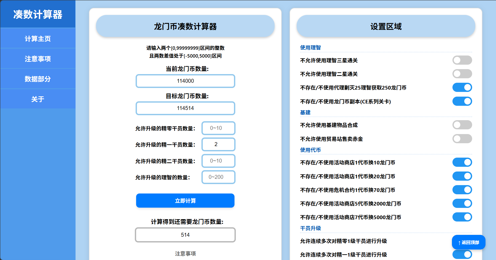
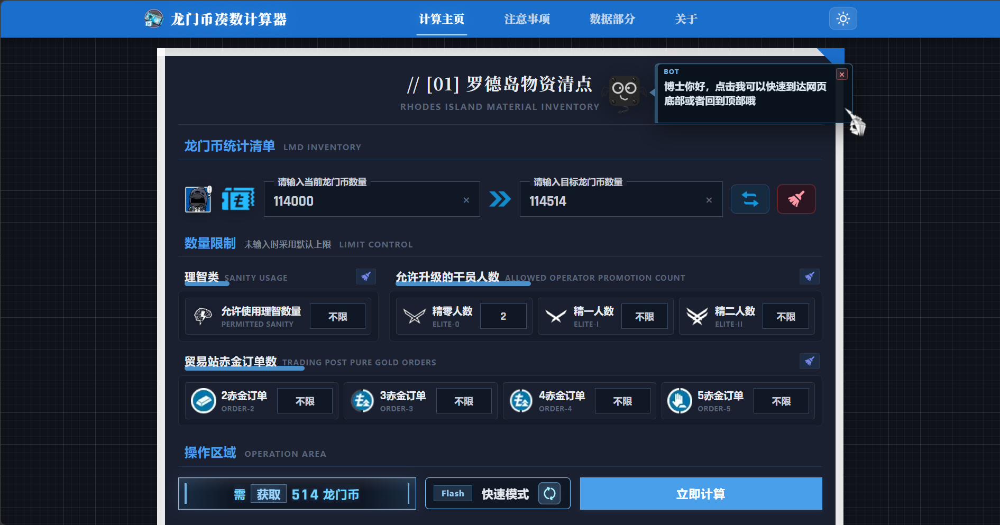

# 明日方舟龙门币凑数计算器

## 🎯项目介绍

这里是明日方舟龙门币凑数计算器，通过计算多个可执行的获取/消耗龙门币方案，帮助你凑出任意龙门币尾数。

本项目是我在2025年初学习前端时做的一个简单练习项目，当时遇到了凑龙门币尾数的需求，但发现此前另一位开发者的凑数计算器因公招不再消耗龙门币而失效，因此在亲爱的D老师和G老师的指导下完成并上线了1.0版本。

上线之后，我一直在关注各个社交平台和游戏社区中的使用情况和反馈，针对各种问题陆续进行优化。



2026年1月，我开始尝试使用claude code和codex辅助开发，并且计划项目重构。2026年4月~6月期间，2.0版本对前端页面设计、移动端适配、计算结果展示和后端计算服务等方面做了较大调整，前端使用TypeScript重写，后端使用Go重构。



## 🌐在线使用

点击访问：[https://ark-lmd.top/](https://ark-lmd.top/)

网页端和移动端均已适配。

## 🔧食用说明

- 打开计算主页。
- 在输入面板中输入当前龙门币数量、目标龙门币数量（范围：0 ~ 99,999,999，差值限制：-5000 ~ 5000）、允许升级的干员数量（0 ~ 10）、允许使用的理智数量（0 ~ 210）和贸易站赤金订单数（0 ~ 10）。
- 在配置面板自定义计算规则（例如禁用某些物品）。
- 点击“立即计算”按钮，查看生成的方案。
- 访问“注意事项”、“数据档案”和“关于”页面以了解更多信息。

## 🗣️页面说明

当前主要页面包括：

- `计算主页`：输入龙门币数量、设置限制、调整计算规则并查看推荐方案。
- `注意事项`：针对输入范围、升级误差、连续升级等容易误解的规则进行说明。
- `数据档案`：展示升级消耗、物品价值、理智速查和方案样例。
- `关于`：展示项目信息、运行统计、反馈入口、外部链接、版本时间轴和声明。
- `维护页`：用于在维护期间显示维护状态和可参考的预制方案样例。
- `后台统计页`：隐藏页面，用于查看服务状态。

## 📦本地部署

### 环境参考

当前项目开发环境参考：

- Node.js：v22.13.0
- npm：10.9.2
- Go：1.26.3
- React：18.2.0
- TypeScript：5.7.0
- Vite：6.1.0

### 安装与启动

```bash
npm install
npm run dev
```

Vite 默认会给出本地访问地址，通常是：

```text
http://localhost:5173/
```

前端开发环境会读取 `.env.development`：

```text
VITE_API_URL=http://localhost:3003
```

如需本地调试完整计算功能，需要同时启动 Go 后端：

```powershell
cd go-backend
$env:PORT="3003"
$env:NODE_ENV="test"
go run ./cmd/server
```

默认端口是 `3003`。`NODE_ENV=test` 时会关闭接口限流，方便本地调试和测试。

## 参考资料

- [干员升级经验及龙门币消耗成本统计(收束测试)](https://ngabbs.com/read.php?tid=16847042)
- [[工具发布]凑龙门币~](https://bbs.nga.cn/read.php?tid=21247901)
- [PRTS Wiki](https://prts.wiki/w/)

## 声明

本项目仅用于学习交流使用。网页所涉及的游戏《明日方舟》相关的名称、数据、素材等均为其各自所有者的资产，仅供识别。
